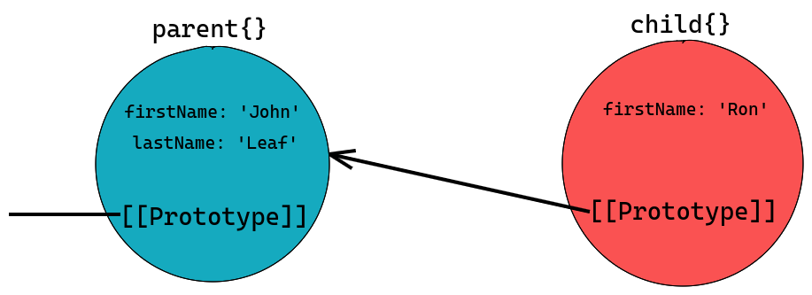
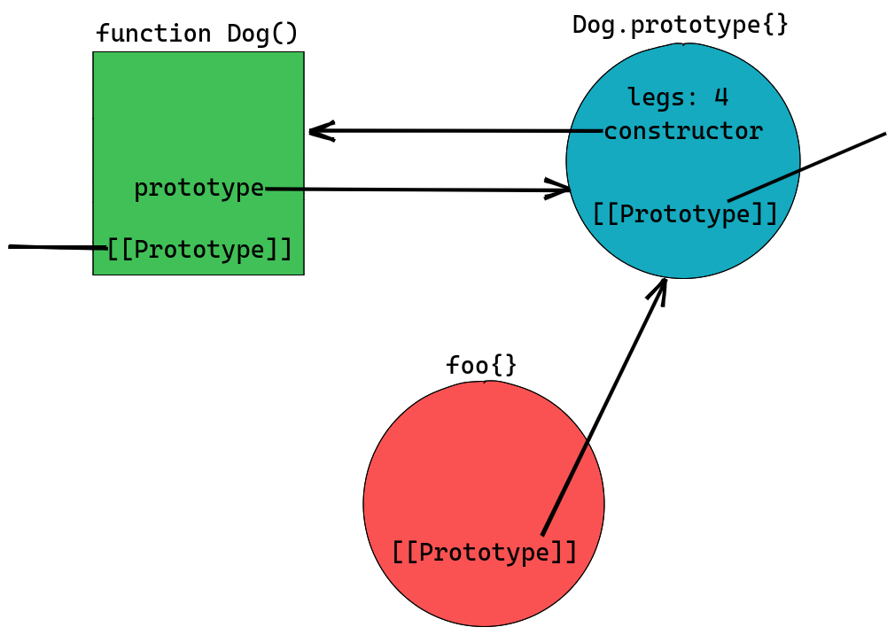
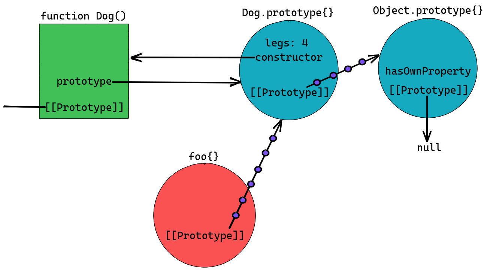
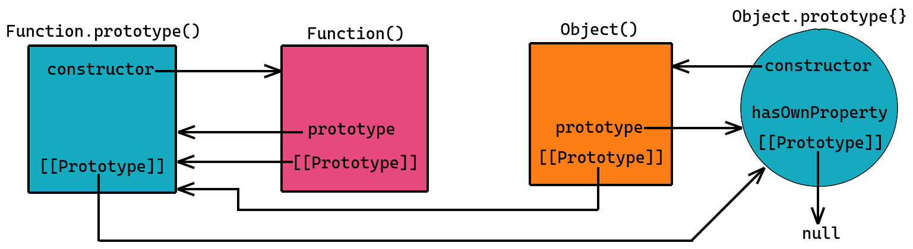
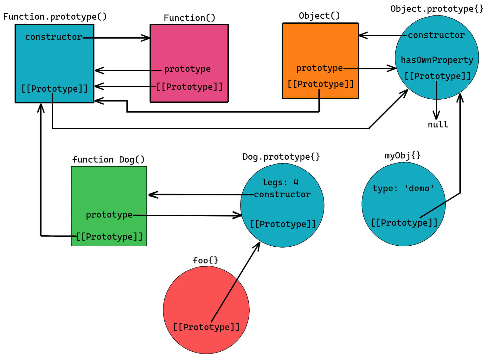

Prototypes in JavaScript are very confusing, you may seem to understand it but still there may be occassions where you are just not sure what's going on. Through this post, we'll try to clear all the confusion and understand the inheritance better in JS.


_Note: All code listed in the post is recommended to run in a repl of chrome or firefox dev tools for better understanding_

Let's begin from the beginning!

**There are 8 kinds of data types in JS.**

***Primitive data types***

1. Number
2. String
3. Boolean
4. Symbol
5. BigInt
6. Null
7. Undefined

***Non primitive data type***

8. object

Objects in JS are a collection of properties, where properties are basically key value pairs. In JS, everything except the primitives are objects. Inheritance in JS is a means of sharing these properties across objects.

JS implements Prototype based inheritance which is often termed as classless implementation of [OO paradigm](https://en.wikipedia.org/wiki/Object-oriented_programming), because there's no concept of blue print there. You can read more about [Prototype based programming](https://en.wikipedia.org/wiki/Prototype-based_programming) or [Class based programming](https://en.wikipedia.org/wiki/Class-based_programming). Prototypal inheritance works in JS through the **Prototype Chain** by delegating behavior to objects using prototypes.

### So what makes a Prototype Chain?

First of all there are two entities in JS language spec which are referred(kinda) to as a prototype. And this creates confusion. Let's first understand **[[Prototype]]**. We'll learn about the other prototype later in the post.

> **[[Prototype]]** is an internal property present on all objects in JS. The value of [[Prototype]] of an object can be null or an object from which it can inherit properties.

Essentially, [[Prototype]] establishes a link (Prototype Link) between two objects which enables the child object to inherit properties from the parent object.

So, in what sense, an object is parent or child in this inheritance model? The parent object holds the properties which a child object may need to access. While, the child object tells who is its parent using the __[[Prototype]]__ internal property. It's an internal property, means we can't directly access this property, like `object.[[Prototype]]`.

__Let's make a simple Prototype chain__

```js
const parent = { firstName: 'John', lastName: 'Leaf' };

const child = { firstName: 'Ron' };

console.log(child.lastName); // undefined

// Lets link the child and parent
Object.setPrototypeOf(child, parent);
```
Now, the value of child's internal `[[Prototype]]` will be parent.

```js
// the value of child's [[Prototype]] is parent
Object.getPrototypeOf(child) === parent; // true

// child inherits the lastName property
console.log(child.lastName); // Leaf

// child doesn't own the lastName property
child.hasOwnProperty('lastName'); // false
```
<br/>

### Then what's a \_\_proto\_\_?

__\_\_proto\_\___ is a [getter/setter](https://javascript.info/property-accessors) to change or see the internal __[[Prototype]]__.
This is supported in browsers and [now in ECMA spec as well](https://developer.mozilla.org/en-US/docs/Web/JavaScript/Reference/Global_Objects/Object/proto), but [not recommended](https://developer.mozilla.org/en-US/docs/Web/JavaScript/Reference/Global_Objects/Object/proto) for use though in favour of `Object.setPrototypeof` and `Object.getPrototypeof`.
```js
child.__proto__ === parent; // true
```
<br/>

### Can we change the inherited property?
No, we can't change an inherited property from the child. But we can override it.
```js
child.lastName = 'Green';

// now child object owns lastName property
child.hasOwnProperty('lastName'); // true

// not the inherited property anymore, it's overridden
console.log(child.lastName); // Green

// parent's property remains intact
console.log(parent.lastName); // Leaf
```

*For an [Accessor property](https://javascript.info/property-accessors), we can get as well as set the inherited property through the child object*

*You would also be wondering how we got access to  the `hasOwnProperty` method on `child` object, does it own the method? We'll see in later section.*
<br/>

### Implicit Prototype link

In the above code example, we explicitly made a [[Prototype]] link between two objects. Now lets see an example of an implicit [[Prototype]] link, which the language does for inheritance.

```js
function Dog(name) {
    this.name = name;
}

console.log(Dog.prototype); // { constructor: f Dog() {} }
```

All [constructor function objects](https://tc39.es/ecma262/#constructor) in JS have a `prototype` property on it, whose value is an object. So, what's the purpose of this object? This object will act as parent, and contains properties which can be shared by the constructor instances. This object has a `constructor` property, whose value is the function object itself.

```js
Dog.prototype.constructor === Dog; // true
```
It may seem from the above expression that `Dog` is the constructor of `Dog.prototype`, but it isn't the case. Don't worry, we'll see its use later.

Okay, let's see inheritance in action

```js
// create an instance of Dog
let foo = new Dog('Foo');

// foo is an object
console.log(foo); // { name: "Foo" }
```
If you are not sure, you should checkout [how the **new** operator works](https://developer.mozilla.org/en-US/docs/Web/JavaScript/Reference/Operators/new). Eventually, it will set the internal `[[Prototype]]` of `foo` to `Dog.prototype` object.

```js
// foo's constructor is Dog
foo.constructor === Dog; // true

// foo doesn't own the constructor property
foo.hasOwnProperty('constructor'); // false
```

This `constructor` property was inherited from `Dog.prototype`. So, now you understand the use of this property on `Dog.prototype`, it is for the prototype linked child objects, which can tell who is their constructor.

```js
// create a shared property for Dog instances
Dog.prototype.legs = 4;

// legs property won't be accessible on the Dog object
console.log(Dog.legs); // undefined

// foo will inherit legs from Dog.prototype
console.log(foo.legs);  // 4
```
Let's see a diagram for this prototype relationship.



_Note: There may be more properties on objects than the ones listed in the diagrams, only the here concerned ones are listed_

__Recap `prototype` vs `[[Prototype]]`__

- **prototype** is the parent object in this inheritance model which actually owns the properties. This object is predefined by JS in all [constructor function objects](https://tc39.es/ecma262/#constructor).

- **[[Prototype]]** is an internal property present on all objects in JS. The value of [[Prototype]] of an object can be null or an object from which it can inherit properties.
<br/>

### A longer Prototype chain
Remember, we've been using `hasOwnProperty` method on objects above. But, does every object has this method?
```js
foo.hasOwnProperty('hasOwnProperty'); // false

// So, has it inherited from Dog?
Dog.prototype.hasOwnProperty('hasOwnProperty'); // false
```
`foo` doesn't have the property, neither its parent `Dog.prototype` has this property. So, it's time to climb up the Prototype chain. Let's see.
```js
Object.getPrototypeOf(Dog.prototype); // {constructor: ƒ, __defineGetter__: ƒ, __defineSetter__: ƒ, hasOwnProperty: ƒ, __lookupGetter__: ƒ, …}

Object.getPrototypeOf(Dog.prototype).hasOwnProperty('hasOwnProperty'); // true

// or we can
Dog.prototype.__proto__.hasOwnProperty('hasOwnProperty'); // true
```
Seems, familiar, and this object owns `hasOwnProperty` method. It's the `Object.prototype` object.
```js
Object.getPrototypeOf(Dog.prototype) === Object.prototype; // true
```
So, `foo` here has been able to access this method of `Object.prototype` by climbing up the chain after not finding it on it's parent. The prototype chain climbing is demonstrated through dots and arrows in the diagram below.



So, that's it. When we access any property on an object in JS, if it's not present on the object, it will look up the prototype chain for that property, even going upto many levels till the end of the chain.
<br/>

### instanceof operator
__Syntax:__
```js
foo instanceof Dog;
```
`instanceof` operator tests whether `Dog.prototype` in present in the Prototype chain of `foo`. The left side of `instanceof` should be an object and right side should be a constructor function.
```js
// Dog.prototype is in foo's prototype chain
foo instanceof Dog; // true

// Object.prototype is in foo's prototype chain
foo instanceof Object; // true
```
<br/>

### More of implicit prototype links

All functions in JS are instance of the [Function constructor](https://developer.mozilla.org/en-US/docs/Web/JavaScript/Reference/Global_Objects/Function).
```js
// Dog constructor function is instance of Function
Dog instanceof Function; // true

// Dog's [[Prototype]] is Function.prototype
Object.getPrototypeOf(Dog) === Function.prototype; // true
```

All objects in JS declared using the `{}` Object literal notation inherit from `Object.prototype`. [Object](https://developer.mozilla.org/en-US/docs/Web/JavaScript/Reference/Global_Objects/Object) is also a constructor. So, these objects are instance of `Object` constructor.
```js
let myObj = { type: 'demo' };

// myObj's [[Prototype]] is Object.prototype
Object.getPrototypeOf(myObj) === Object.prototype; // true

// myObj is instance of Object
myObj instanceof Object; // true
```

*Note: objects can also be created by explicitly specifying it's [[Prototype]] using [Object.create()](https://developer.mozilla.org/en-US/docs/Web/JavaScript/Reference/Global_Objects/Object/create).*
<br/>

### Prototypes everywhere
So, we discussed that all objects in JS have `[[Prototype]]` internal property and constructor functions also have a `prototype` property. Now thinking about `Function`, `Object` constructors, functions that we create using `function` keyword, objects created using `{}`, a `Date` object or an array, basically every object in JS. How everything fits together in this prototype based inheritance in JS?

__or some weird looking things__
```js
Object instanceof Function; // true

Function instanceof Object; // true

Function instanceof Function; // true

Object instanceof Object; // true
```
We'll be able to justify all these expressions after understanding their prototype relationship.
<br/>


### The complete picture
After fiddling around these objects and their prototype chain, I was able to draw this diagram.


Key takeaways from this diagram:
- `Function` and `Object` are constructor function objects.
- [[Prototype]] of `Object.prototype` is `null` which marks the end of prototype chain.
- `Function.prototype` is a function object, but is not a constructor and doesn't even have a `prototype` property just like other function objects. It [should not have been a function object](https://stackoverflow.com/a/32929083/8329592).
- We can now easily deduce the above listed `instanceof` expressions.

Let's see one example;
```js
Function instanceof Object; // true
```
This means we need to find whether `Object.prototype` is in `Function`'s prototype chain or not, which can be easily found by following the [[Prototype]] links. Try all the `instanceof` expressions used above.

With the objects and function used earlier, the whole prototype relationship looks like this.



I hope this post helped you understand prototype based inheritance based in JS. I would recommend to play with these objects in your browser's console to solidify the concepts.

Thanks for reading and let me know your thoughts :)